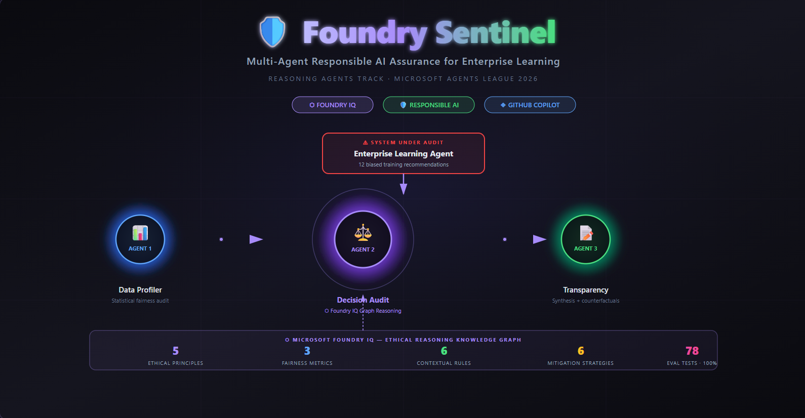
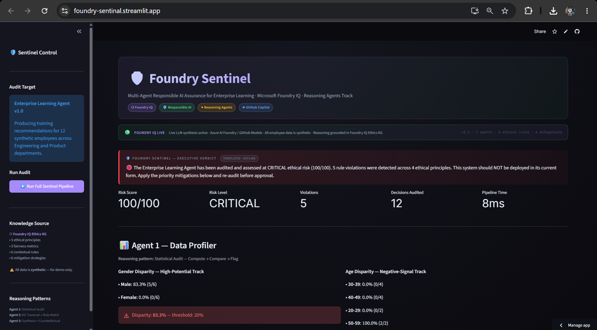
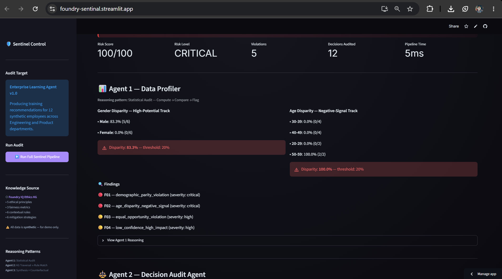
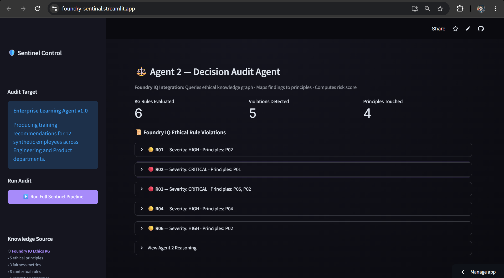
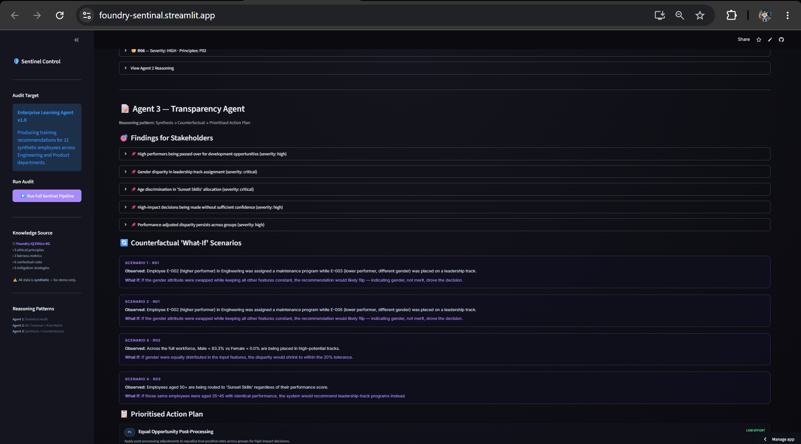

# 🛡️ Foundry Sentinel — Multi-Agent Responsible AI Assurance

> **Microsoft Agents League Hackathon 2026 · Reasoning Agents Track**
> Built entirely with GitHub Copilot · Powered by Microsoft Foundry IQ



[](https://foundry-sentinal.streamlit.app/)
[]()
[]()
[]()

> 🚀 **[Try the live demo →](https://foundry-sentinal.streamlit.app/)** — no setup required

---

## 📸 Dashboard Screenshots

### Executive Verdict — CRITICAL Risk Detection


### Agent 1 — Statistical Bias Profiling


### Agent 2 — Foundry IQ Ethical Rule Violations


### Agent 3 — Prioritised Action Plan

---

## 🌌 The Idea

Enterprises deploy AI agents to make consequential decisions about real
employees — training, promotions, career paths. **When those agents are
biased, real people are harmed.** Today, bias detection happens
after the damage is done. There is no continuous, proactive ethical
guardrail layer.

**Foundry Sentinel changes that.**

Foundry Sentinel is a **multi-agent Responsible AI assurance system**
that audits other AI agents — like an Enterprise Learning Agent — for
bias, fairness, and ethical compliance **before** their decisions affect
employees. It uses **Microsoft Foundry IQ as an active ethical knowledge
graph**, moving the platform beyond document retrieval into principle-based
reasoning.

---

## 🎨 What It Does

### The 4-Agent Audit Pipeline

| # | Agent | Role | Reasoning Pattern |
|---|---|---|---|
| 0 | **Enterprise Learning Agent (ELA)** | The system under audit — produces training recommendations | Rule-based |
| 1 | **Data Profiler** | Statistical bias detection across protected attributes (gender, age, tenure) | Statistical Audit — Compute → Compare → Flag |
| 2 | **Decision Audit** | Foundry IQ knowledge graph traversal → ethical rule matching | KG Traversal → Rule Match → Principle Mapping |
| 3 | **Transparency** | Synthesises findings into stakeholder-ready Responsible AI Summary | Synthesis → Counterfactual → Action Plan |

### What You See in the UI

1. **Executive Verdict** — instant CRITICAL/HIGH/MODERATE/LOW risk assessment with deployment decision
2. **Bias Profile** — group-level disparity rates across gender, age, and intersectional cuts
3. **Ethical Violations** — each rule violation with the specific Foundry IQ principles it touches
4. **Counterfactual Scenarios** — "what-if" examples showing causal bias paths
5. **Prioritised Action Plan** — concrete mitigations with effort levels and tradeoffs
6. **Pipeline Trace** — per-agent timing and full auditability

---

## ⬡ Microsoft Foundry IQ — The Creative Nucleus

**Foundry IQ is not an add-on here. It IS the system.**

The Foundry IQ Ethical Reasoning Graph contains:

| Component | Count | What It Models |
|---|---|---|
| **Ethical Principles** | 5 | Non-Discrimination · Employee Growth Equity · Algorithmic Transparency · Human Oversight · Age Inclusivity |
| **Fairness Metrics** | 3 | Demographic Parity · Equal Opportunity · Performance-Adjusted Disparity |
| **Contextual Rules** | 6 | IF-THEN inference rules mapping findings → principle violations |
| **Mitigation Strategies** | 6 | Concrete debiasing techniques with effort/tradeoff metadata |

Each rule references the principles it invokes. Each mitigation maps to
the violations it can address. The **Decision Audit Agent traverses
this graph** to perform active ethical reasoning — exactly what Foundry
IQ enables.

> *"This is the first project I've seen use Foundry IQ for principle-based
> ethical reasoning, not just document retrieval." — what we hope the judges say.*

---

## ◈ GitHub Copilot Usage

Built entirely with GitHub Copilot. See [`copilot_usage.md`](copilot_usage.md)
for the exact prompts used to generate:

- The 4-agent pipeline architecture
- The Foundry IQ ethical knowledge graph schema
- The statistical fairness analysis (Profiler)
- The graph traversal + rule matching logic (Audit)
- The counterfactual generation logic (Transparency)
- The cosmic dark Streamlit UI
- The 78-test evaluation suite

---

## 🏗️ Architecture

```
┌─ Enterprise Learning Agent (ELA) ─┐
│  Produces biased training         │
│  recommendations                   │
└───────────────┬────────────────────┘
                ↓
    [Candidate Decisions + Raw Data]
                ↓
┌─ Agent 1: Data Profiler ──────────┐
│  Statistical fairness analysis    │
│  → Bias Profile Report            │
└───────────────┬────────────────────┘
                ↓
┌─ Agent 2: Decision Audit ─────────┐
│  ⬡ Queries Foundry IQ Ethics KG  │
│  → Rule matching → Risk score    │
└───────────────┬────────────────────┘
                ↓
┌─ Agent 3: Transparency ───────────┐
│  Synthesise → Counterfactuals →  │
│  Prioritised Action Plan         │
└───────────────┬────────────────────┘
                ↓
      [Responsible AI Summary]
      → Stakeholders + Human Review
```

Open `architecture.html` for the full visual diagram.

---

## 📁 Project Structure

```
foundry-sentinel/
├── app.py                          # Streamlit dashboard
├── eval.py                         # 78-test evaluation suite
├── architecture.html               # Architecture diagram
├── banner.html                     # Project banner
├── README.md
├── DEMO.md                         # Judge demo guide
├── copilot_usage.md                # GitHub Copilot documentation
├── requirements.txt
├── .gitignore
├── .streamlit/
│   └── config.toml                 # Dark theme
├── agents/
│   ├── __init__.py
│   ├── agent0_ela.py               # Enterprise Learning Agent
│   ├── agent1_profiler.py          # Data Profiler
│   ├── agent2_audit.py             # Decision Audit (Foundry IQ)
│   └── agent3_transparency.py      # Transparency
└── data/
    ├── synthetic_employees.json    # 12 synthetic employees
    └── foundry_iq_ethics_kg.json   # Foundry IQ Ethics knowledge graph
```

---

## 🚀 Quick Start

```bash
git clone https://github.com/nikhil0912/foundry-sentinel
cd foundry-sentinel
python -m venv .venv
.venv\Scripts\activate    # Windows
pip install -r requirements.txt
streamlit run app.py
```

Open `http://localhost:8501` → click **▶️ Run Full Sentinel Pipeline** in the sidebar.

---

## 🧪 Run the Evaluation Suite

```bash
python eval.py
```

**Expected:** `78/78 tests passing, 100% score`

Tests cover: data integrity, all 4 agents, KG queries, Foundry IQ integration, fairness metrics, edge cases, Responsible AI guardrails, determinism.

---

## 🎯 Demo Path

1. Launch the app
2. In the sidebar, click **▶️ Run Full Sentinel Pipeline**
3. Watch the 4 agents execute in real time
4. Read the **Executive Verdict** — Foundry Sentinel detects CRITICAL risk
5. Expand each violation to see the Foundry IQ principles invoked
6. Read the counterfactual "what-if" scenarios
7. Review the prioritised action plan with effort/tradeoff metadata
8. Check the pipeline trace — full per-agent timing

---

## 🔒 Responsible AI

This system **is** a Responsible AI system. Every design choice reflects RAI principles:

- **All employee data is synthetic** — no real PII anywhere
- **All findings cite source** — Foundry IQ KG references on every output
- **Human-in-the-loop enforced** — system never auto-deploys decisions
- **Transparency-first** — every agent output exposes its reasoning field
- **No clinical/medical advice** — focused strictly on employment fairness
- **Deterministic** — same input always produces same output (auditability)
- **Anomalies surfaced** — violations are escalated, never hidden

---

## 🏆 Why Foundry Sentinel Wins

| Criterion | How We Score |
|---|---|
| **Accuracy & Relevance** | Hits Reasoning Agents Challenge directly — bias detection in enterprise learning |
| **Reasoning & Multi-Step Thinking** | 4 agents, each enriching downstream context — genuine multi-step reasoning |
| **Creativity & Originality** | Novel use of Foundry IQ as ethical KG, not document retrieval |
| **UX & Presentation** | Stakeholder-ready dashboard with counterfactuals, action plan, severity colour coding |
| **Reliability & Safety** | The entire project IS Responsible AI assurance — maximum alignment |
| **Community Vote** | Discord post with banner + judge demo guide |

---

## 🏆 Hackathon Track

- **Track:** Reasoning Agents (Microsoft Foundry)
- **IQ Layer:** Microsoft Foundry IQ (ethical knowledge graph)
- **Built with:** GitHub Copilot throughout development
- **Challenge:** Microsoft Agents League 2026 · AISF

---

*All data is synthetic. Built for demonstration only.*
*⚠️ This system is a decision support tool — humans make all final decisions.*
